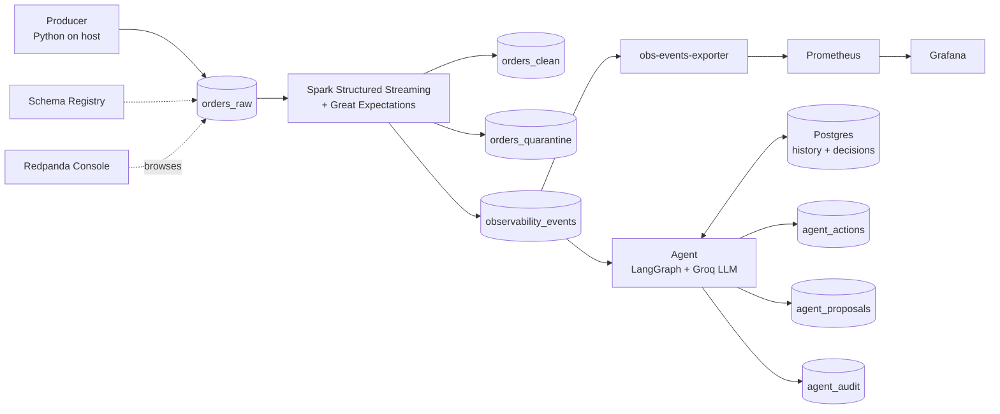

# Real-Time Data Quality Observability — Agentic POC

> An end-to-end, dockerized, open-source proof-of-concept that streams order events through Kafka, validates data quality at both record and batch level using **Great Expectations**, emits structured observability events, exposes Prometheus metrics, visualizes KPIs in Grafana, and uses an **LLM-powered agent** (LangGraph + Groq) to autonomously triage data quality breaches.

---

## Table of Contents

1. [Architecture Overview](#1-architecture-overview)
2. [What This POC Demonstrates](#2-what-this-poc-demonstrates)
3. [Tech Stack](#3-tech-stack)
4. [Directory Layout](#4-directory-layout)
5. [Prerequisites](#5-prerequisites)
6. [Phase 0 — Foundation Setup](#6-phase-0--foundation-setup)
7. [Phase 1 — Data Producer](#7-phase-1--data-producer)
8. [Phase 2 — Stream Processing & Data Quality with Great Expectations](#8-phase-2--stream-processing--data-quality-with-great-expectations)
9. [Phase 3 — Prometheus & Grafana Observability](#9-phase-3--prometheus--grafana-observability)
10. [Phase 4 — Agentic DQ Triage (LangGraph + Groq)](#10-phase-4--agentic-dq-triage-langgraph--groq)
11. [Daily Operations](#11-daily-operations)
12. [Topics Reference](#12-topics-reference)
13. [Service URLs](#13-service-urls)
14. [Inspecting the Agent's Activity](#14-inspecting-the-agents-activity)
15. [Troubleshooting](#15-troubleshooting)
16. [Roadmap](#16-roadmap)

---

## 1. Architecture Overview



### Two layers of data quality

| Layer | Engine | Granularity | Output |
|---|---|---|---|
| Record-level routing | PySpark column rules | per-row | `orders_clean` vs `orders_quarantine` |
| Batch-level validation | **Great Expectations** | per micro-batch | `observability_events` (one per rule) |

### Two layers of response

| Layer | Engine | Trigger | Action |
|---|---|---|---|
| Metrics & dashboards | Prometheus + Grafana | every event | visualize KPIs |
| Intelligent triage | **LangGraph agent + Groq LLM** | every BREACH | pick a tool, execute, audit |

---

## 2. What This POC Demonstrates

- **Real-time streaming DQ** — sub-minute detection latency on order events
- **Declarative expectations** — Great Expectations suite written as JSON, not code
- **Failure separation** — 4 dedicated Kafka topics keep ingestion, trusted data, quarantine, and DQ verdicts cleanly decoupled
- **Live operational KPIs** — Grafana dashboard with 8 panels showing DQ Score, breach rates, null %, per-rule status, and consumer health
- **Agentic triage** — LangGraph state machine + Groq-hosted Llama 3.3 70B reasons over breach + history, selects exactly one of 4 tools, and executes
- **Full audit trail** — every agent decision recorded to Postgres + Kafka with reasoning and token usage
- **100% open-source** — no vendor lock-in, runs entirely under `docker compose`

---

## 3. Tech Stack

| Layer | Tool | Purpose |
|---|---|---|
| Streaming backbone | Apache Kafka 3.9 (KRaft mode) | Event transport, no ZooKeeper |
| Schema governance | Confluent Schema Registry 7.7 | Contract enforcement (ready, JSON used for POC) |
| Kafka UI | Redpanda Console v3 | Visual topic inspector |
| Stream processing | Apache Spark 4.0.2 | Structured Streaming micro-batches |
| DQ rule engine | **Great Expectations 0.18.19** | Declarative expectation suite |
| Producer | Python + kafka-python-ng | Data simulator with failure injection |
| Metric sink | Prometheus 2.54 | TSDB for DQ metrics |
| Visualization | Grafana 11 | Dashboards & KPIs |
| Agent runtime | **LangGraph 0.2 + LangChain 0.3** | State machine for LLM reasoning |
| LLM provider | **Groq** (Llama 3.3 70B Versatile) | Tool-calling LLM, free tier |
| Agent memory | Postgres 16 | History + decision log |
| Container runtime | Docker Compose | Local orchestration |

---

## 4. Directory Layout

```
realtime-dq-poc/
├── docker-compose.yml             # All services
├── .env                           # API keys (gitignored)
├── .gitignore
├── README.md                      # This file
│
├── producer/                      # Host-side data simulator
│   ├── orders_producer.py
│   ├── requirements.txt
│   └── .venv/
│
├── jobs/                          # Mounted into Spark at /opt/jobs
│   ├── dq_stream_job.py           # Great Expectations DQ stream job
│   ├── smoke_test.py
│   └── dq/
│       └── orders_suite.json      # Great Expectations expectation suite
│
├── obs-consumer/                  # Kafka → Prometheus bridge
│   ├── obs_events_exporter.py
│   ├── requirements.txt
│   └── Dockerfile
│
├── prometheus/
│   └── prometheus.yml             # Scrape config
│
├── grafana/
│   ├── provisioning/
│   │   ├── datasources/prometheus.yml
│   │   └── dashboards/dashboards.yml
│   └── dashboards/
│       └── dq_overview.json       # 8-panel DQ dashboard
│
├── jars/                          # Spark Kafka connector + friends (gitignored)
│   ├── spark-sql-kafka-0-10_2.13-4.0.2.jar
│   ├── spark-token-provider-kafka-0-10_2.13-4.0.2.jar
│   ├── kafka-clients-3.9.0.jar
│   └── commons-pool2-2.12.0.jar
│
└── agent/                         # LangGraph DQ triage agent
    ├── Dockerfile
    ├── requirements.txt
    ├── agent.py                   # Main consumer loop
    ├── graph.py                   # LangGraph state machine + ChatGroq
    ├── prompts/
    │   └── triage_system.txt      # LLM system prompt
    ├── state/
    │   ├── __init__.py
    │   └── store.py               # Postgres wrapper
    └── tools/
        ├── __init__.py
        ├── kafka_tools.py         # 3 action tools
        └── notify_tools.py        # 1 notification tool
```

---

## 5. Prerequisites

- **Docker Desktop** (Windows/Mac) or Docker Engine + Compose plugin (Linux)
- **Python 3.10+** on host (for the producer)
- **Groq API key** — free tier at https://console.groq.com
- ~6 GB free RAM, ~10 GB free disk
- Open ports: 3000, 5432, 7077, 8080, 8081, 8090, 8091, 9090, 9094, 9108

### API Keys (create `.env` file)

In project root, create `.env`:

```env
GROQ_API_KEY=gsk_xxx...your-real-key...
SLACK_WEBHOOK_URL=
```

`.gitignore` already excludes `.env`.

---

## 6. Phase 0 — Foundation Setup

Brings up Kafka (KRaft), Schema Registry, Redpanda Console, Spark master + worker, Postgres.

### 6.1 Initial directory prep

```powershell
mkdir jobs data
```

### 6.2 Start the stack

```powershell
docker compose up -d
docker compose ps
```

All services should show `healthy` or `up`.

### 6.3 Create the 4 core Kafka topics

```powershell
docker exec kafka /opt/kafka/bin/kafka-topics.sh --bootstrap-server kafka:9092 --create --topic orders_raw --partitions 3 --replication-factor 1 --if-not-exists
docker exec kafka /opt/kafka/bin/kafka-topics.sh --bootstrap-server kafka:9092 --create --topic orders_clean --partitions 3 --replication-factor 1 --if-not-exists
docker exec kafka /opt/kafka/bin/kafka-topics.sh --bootstrap-server kafka:9092 --create --topic orders_quarantine --partitions 3 --replication-factor 1 --if-not-exists
docker exec kafka /opt/kafka/bin/kafka-topics.sh --bootstrap-server kafka:9092 --create --topic observability_events --partitions 3 --replication-factor 1 --if-not-exists
```

### 6.4 Smoke test — verify Kafka ↔ Spark connectivity

```powershell
docker exec spark-master /opt/spark/bin/spark-submit --master spark://spark-master:7077 /opt/jobs/smoke_test.py
```

In a second terminal, push a test message:
```powershell
docker exec -it kafka /opt/kafka/bin/kafka-console-producer.sh --bootstrap-server kafka:9092 --topic orders_raw
```
Type:
```json
{"order_id":"1","customer_id":"c-1","amount":42}
```

Spark console prints the message within seconds. Foundation verified.

---

## 7. Phase 1 — Data Producer

### 7.1 One-time Python env setup

```powershell
cd producer
python -m venv .venv
.\.venv\Scripts\Activate.ps1
pip install -r requirements.txt
```

### 7.2 Baseline run — clean data

```powershell
python orders_producer.py --rps 8.3 --duration 60
```

~500 clean records → `orders_raw`.

### 7.3 Run with realistic failures

```powershell
python orders_producer.py --rps 10 --duration 120 --null-rate 0.05 --dup-rate 0.02 --late-rate 0.01 --drift-rate 0.005 --email-bad-rate 0.03
```

### 7.4 Stress test

```powershell
python orders_producer.py --rps 1000 --duration 10
```

### 7.5 Producer flags reference

| Flag | Meaning | Effect on DQ |
|---|---|---|
| `--rps N` | Records per second | Volume |
| `--duration N` | Run length in seconds | Total events |
| `--null-rate P` | Probability of null `customer_id` | Triggers R-COMPL-001 |
| `--dup-rate P` | Probability of duplicate `order_id` | Triggers R-UNIQ-001 |
| `--email-bad-rate P` | Probability of malformed email | Triggers R-VALID-001 |
| `--late-rate P` | Probability of late `event_time` | Late-arrival simulation |
| `--drift-rate P` | Probability of schema drift | Schema validation tests |
| `--spike-mult N` | Volume spike multiplier | Volume burst tests |

---

## 8. Phase 2 — Stream Processing & Data Quality with Great Expectations

Spark Structured Streaming job that, per micro-batch (every 30 seconds):

1. Reads `orders_raw`
2. Splits records via PySpark: clean → `orders_clean`, bad → `orders_quarantine` (with `_reason`)
3. Runs **Great Expectations** on the whole batch
4. Emits one observability event per rule to `observability_events`

### 8.1 Setup Kafka jars for Spark (one-time)

Spark needs the Kafka connector + 3 friend jars. Download from Maven on host into `jars/`:

- https://repo1.maven.org/maven2/org/apache/spark/spark-sql-kafka-0-10_2.13/4.0.2/spark-sql-kafka-0-10_2.13-4.0.2.jar
- https://repo1.maven.org/maven2/org/apache/spark/spark-token-provider-kafka-0-10_2.13/4.0.2/spark-token-provider-kafka-0-10_2.13-4.0.2.jar
- https://repo1.maven.org/maven2/org/apache/kafka/kafka-clients/3.9.0/kafka-clients-3.9.0.jar
- https://repo1.maven.org/maven2/org/apache/commons/commons-pool2/2.12.0/commons-pool2-2.12.0.jar

Copy into Spark containers:

```powershell
docker exec spark-master mkdir -p /opt/spark/jars-extra
docker exec spark-worker mkdir -p /opt/spark/jars-extra

docker cp .\jars\spark-sql-kafka-0-10_2.13-4.0.2.jar          spark-master:/opt/spark/jars-extra/
docker cp .\jars\spark-token-provider-kafka-0-10_2.13-4.0.2.jar spark-master:/opt/spark/jars-extra/
docker cp .\jars\kafka-clients-3.9.0.jar                       spark-master:/opt/spark/jars-extra/
docker cp .\jars\commons-pool2-2.12.0.jar                      spark-master:/opt/spark/jars-extra/

docker cp .\jars\spark-sql-kafka-0-10_2.13-4.0.2.jar          spark-worker:/opt/spark/jars-extra/
docker cp .\jars\spark-token-provider-kafka-0-10_2.13-4.0.2.jar spark-worker:/opt/spark/jars-extra/
docker cp .\jars\kafka-clients-3.9.0.jar                       spark-worker:/opt/spark/jars-extra/
docker cp .\jars\commons-pool2-2.12.0.jar                      spark-worker:/opt/spark/jars-extra/

docker exec spark-master sh -c "cp /opt/spark/jars-extra/*.jar /opt/spark/jars/"
docker exec spark-worker  sh -c "cp /opt/spark/jars-extra/*.jar /opt/spark/jars/"
```

### 8.2 Install Great Expectations in Spark containers

```powershell
docker exec spark-master pip install --break-system-packages "great-expectations==0.18.19"
docker exec spark-worker  pip install --break-system-packages "great-expectations==0.18.19"
```

Verify:
```powershell
docker exec spark-master python3 -c "import great_expectations; print(great_expectations.__version__)"
```
Should print `0.18.19`.

### 8.3 The Expectation Suite — `jobs/dq/orders_suite.json`

Six declarative rules, each with `rule_id`, `dimension`, and `severity` in `meta`:

| Rule ID | Expectation | Dimension | Severity |
|---|---|---|---|
| R-COMPL-002 | `order_id` never null | completeness | CRITICAL |
| R-COMPL-001 | `customer_id` ≥99% non-null | completeness | WARN |
| R-UNIQ-001 | `order_id` unique within batch | uniqueness | CRITICAL |
| R-VALID-001 | `email` ≥99% valid format | validity | WARN |
| R-VALID-002 | `quantity` in [1, 1000] | validity | WARN |
| R-VOL-001 | batch row count > 0 | volume | CRITICAL |

### 8.4 Run the DQ stream job

```powershell
docker exec spark-master /opt/spark/bin/spark-submit --master spark://spark-master:7077 /opt/jobs/dq_stream_job.py
```

Per micro-batch log lines:
```
[ge] R-VOL-001    outcome=pass value=1500.0 threshold=1.0
[ge] R-COMPL-001  outcome=fail value=15.0   threshold=0.99
[dq] batch=0 size=1500 clean=1275 quarantined=225 checks=6 breaches=2
```

### 8.5 Observability event schema

Each rule evaluation → one JSON message on `observability_events`:

```json
{
  "event_id": "f1e2...",
  "pipeline_id": "orders-ingestion-pipeline",
  "batch_id": "3",
  "entity": "kafka.orders_raw",
  "metric": "expect_column_values_to_not_be_null",
  "dq_dimension": "completeness",
  "rule_id": "R-COMPL-001",
  "value": 15.0,
  "threshold": 0.99,
  "status": "BREACH",
  "severity": "WARN",
  "timestamp": "2026-06-13T12:15:30Z",
  "metadata": { "batch_size": 1500, "check_outcome": "fail" }
}
```

---

## 9. Phase 3 — Prometheus & Grafana Observability

### 9.1 Already started in Phase 0

```powershell
docker compose up -d obs-events-exporter prometheus grafana
```

### 9.2 Verify each layer

```powershell
# Exporter
curl http://localhost:9108/metrics

# Prometheus
# → http://localhost:9090/targets → obs-events-exporter must be UP

# Grafana
# → http://localhost:3000 (admin/admin)
# → Dashboards → Data Quality → Real-Time Data Quality Observability
```

### 9.3 Metrics exposed by `obs-events-exporter`

| Metric | Type | Labels | Purpose |
|---|---|---|---|
| `dq_metric_value` | Gauge | rule_id, dq_dimension, pipeline_id | Latest measured value |
| `dq_metric_threshold` | Gauge | rule_id, dq_dimension, pipeline_id | Rule threshold |
| `dq_events_total` | Counter | rule_id, dq_dimension, severity, status | Event count by outcome |
| `dq_last_event_timestamp_seconds` | Gauge | pipeline_id | Freshness canary |
| `dq_consumer_up` | Gauge | none | Consumer health: 1=up, 0=down |

### 9.4 Dashboard panels

1. **DQ Score (100 − %breaches)** — executive KPI
2. **Alerts Triggered (5m)** — recent breach count
3. **Critical Breaches (5m)** — pageable breaches (severity=CRITICAL)
4. **Consumer Up** — pipeline health canary
5. **Null % (customer_id)** — measured value vs threshold line
6. **Breach rate by dimension** — per-dimension breach intensity
7. **Events by Rule (last 1h)** — which rules breach most (filtered to status=BREACH)
8. **Latest value per rule** — instant snapshot table

---

## 10. Phase 4 — Agentic DQ Triage (LangGraph + Groq)

LLM-powered triage agent that consumes `observability_events`, reasons over each breach with historical context, picks exactly one of 4 tools, executes, and writes a full audit trail.

### 10.1 Why an agent

Static rule engines can detect breaches but cannot adapt to *context*. The agent reads each breach alongside the rule's last 10 outcomes and decides:
- Is this a one-off blip? → `ignore_breach`
- Is this a sustained pattern of the same value? → `propose_threshold_change`
- Is this severe and batch-wide? → `quarantine_batch`
- Is this novel or ambiguous? → `notify_human`

### 10.2 Create the 3 agent topics

```powershell
docker exec kafka /opt/kafka/bin/kafka-topics.sh --bootstrap-server kafka:9092 --create --topic agent_actions --partitions 3 --replication-factor 1 --if-not-exists
docker exec kafka /opt/kafka/bin/kafka-topics.sh --bootstrap-server kafka:9092 --create --topic agent_proposals --partitions 3 --replication-factor 1 --if-not-exists
docker exec kafka /opt/kafka/bin/kafka-topics.sh --bootstrap-server kafka:9092 --create --topic agent_audit --partitions 3 --replication-factor 1 --if-not-exists
```

### 10.3 Verify Postgres is up

```powershell
docker compose up -d postgres
docker exec postgres psql -U dq -d dq -c "SELECT version();"
```

The agent will auto-create two tables on startup: `batch_history` and `agent_decisions`.

### 10.4 Set Groq key in `.env`

```env
GROQ_API_KEY=gsk_xxx...real-key...
```

### 10.5 Build and start the agent

```powershell
docker compose build agent
docker compose up -d agent
docker compose logs agent -f
```

Healthy startup:
```
=== DQ triage agent starting ===
dry_run=False model=llama-3.3-70b-versatile
state store connected
consumer connected to kafka:9092 topic=observability_events
```

### 10.6 Trigger breaches and watch the agent reason

In a separate terminal:
```powershell
cd producer
.\.venv\Scripts\Activate.ps1
python orders_producer.py --rps 50 --duration 60 --null-rate 0.15 --dup-rate 0.10
```

Within 30–60 seconds, agent log shows:
```
breach: batch=2 rule=R-COMPL-001 severity=WARN value=15.2
decision <uuid>: tools=propose_threshold_change(...) tokens_in=2145 tokens_out=78
breach: batch=2 rule=R-UNIQ-001 severity=CRITICAL value=50.0
decision <uuid>: tools=quarantine_batch(...) tokens_in=2210 tokens_out=64
```

### 10.7 Agent's 4 tools

| Tool | Writes to | When the agent uses it |
|---|---|---|
| `quarantine_batch(batch_id, reason)` | `agent_actions` | Severe batch-wide failure (60%+ nulls, schema breakdown) |
| `propose_threshold_change(rule_id, current, proposed, justification)` | `agent_proposals` | Sustained breaches at the same level — threshold likely mis-calibrated |
| `ignore_breach(batch_id, rule_id, justification)` | `agent_actions` | One-off blip after sustained clean batches |
| `notify_human(severity, summary, evidence)` | `agent_actions` (+ Slack if configured) | Novel, ambiguous, or genuinely uncertain situation |

### 10.8 LangGraph state machine

```
        START
          │
          ▼
   ┌─────────────┐
   │   REASON    │ ◄── LLM examines messages, decides
   │ (ChatGroq)  │
   └──────┬──────┘
          │
     called tool?
       /     \
      yes     no
      │       │
      ▼       ▼
  ┌──────┐   END
  │TOOLS │ ◄── execute selected tool
  └──┬───┘
     │ (result added to messages)
     │
     └──► loop back to REASON
```

Most decisions complete in 3 steps: 1 LLM call to reason → 1 tool invocation → 1 final LLM call to confirm. Average latency ~0.5–1.5 seconds.

---

## 11. Daily Operations

### Start everything from cold

```powershell
docker compose up -d
docker compose ps
```

### Run the DQ stream job

```powershell
docker exec spark-master /opt/spark/bin/spark-submit --master spark://spark-master:7077 /opt/jobs/dq_stream_job.py
```

### Run the producer

```powershell
cd producer
.\.venv\Scripts\Activate.ps1

# clean run
python orders_producer.py --rps 50 --duration 30

# with realistic failures
python orders_producer.py --rps 50 --duration 60 --null-rate 0.15 --dup-rate 0.10
```

### Stop everything (keeps data)

```powershell
docker compose down
```

### Nuke everything (wipes all volumes)

```powershell
docker compose down -v
```

### Tail a service log

```powershell
docker compose logs <service-name> --tail 30 -f
```

### Reset Spark checkpoint (after code changes)

```powershell
docker exec spark-master rm -rf /opt/checkpoints/dq_stream_job
```

### Reset agent consumer offsets (replay all events)

```powershell
docker compose stop agent
docker exec kafka /opt/kafka/bin/kafka-consumer-groups.sh --bootstrap-server kafka:9092 --group dq-triage-agent --reset-offsets --to-earliest --topic observability_events --execute
docker compose start agent
```

---

## 12. Topics Reference

| Topic | Producer | Consumer(s) | Role |
|---|---|---|---|
| `orders_raw` | Python producer | Spark DQ job | Unfiltered ingestion log |
| `orders_clean` | Spark DQ job | Downstream consumers | Validated records |
| `orders_quarantine` | Spark DQ job | Data stewards | Bad records + `_reason` |
| `observability_events` | Spark DQ job | obs-events-exporter, agent | Per-rule DQ verdicts |
| `agent_actions` | Agent | Audit, dashboards | Direct agent actions (autonomous) |
| `agent_proposals` | Agent | Human approval workflow | Proposed changes pending review |
| `agent_audit` | Agent | Compliance, debugging | Full reasoning trail + tokens |

---

## 13. Service URLs

| Service | URL | Login |
|---|---|---|
| Redpanda Console (Kafka UI) | http://localhost:8080 | — |
| Schema Registry | http://localhost:8081 | — |
| Spark Master UI | http://localhost:8090 | — |
| Spark Worker UI | http://localhost:8091 | — |
| Prometheus | http://localhost:9090 | — |
| Grafana dashboard | http://localhost:3000/d/rt-dq-obs | admin / admin |
| obs-events-exporter `/metrics` | http://localhost:9108/metrics | — |
| Postgres | `localhost:5432` | dq / dq / db: dq |

---

## 14. Inspecting the Agent's Activity

### Recent decisions with reasoning snippet

```powershell
docker exec postgres psql -U dq -d dq -c "SELECT batch_id, rule_id, tool, LEFT(reasoning, 80) AS reasoning FROM agent_decisions ORDER BY ts DESC LIMIT 10;"
```

### Tool usage breakdown

```powershell
docker exec postgres psql -U dq -d dq -c "SELECT tool, COUNT(*) FROM agent_decisions GROUP BY tool ORDER BY COUNT(*) DESC;"
```

### Total token usage

```powershell
docker exec postgres psql -U dq -d dq -c "SELECT COUNT(*) AS decisions, SUM(tokens_input) AS input_tokens, SUM(tokens_output) AS output_tokens FROM agent_decisions;"
```

### Full audit trail in Kafka

```powershell
docker exec kafka /opt/kafka/bin/kafka-console-consumer.sh --bootstrap-server kafka:9092 --topic agent_audit --from-beginning --max-messages 20
```

Or browse in Redpanda Console: http://localhost:8080 → topic `agent_audit`.

### Agent's pending proposals (awaiting human approval)

```powershell
docker exec kafka /opt/kafka/bin/kafka-console-consumer.sh --bootstrap-server kafka:9092 --topic agent_proposals --from-beginning
```

---

## 15. Troubleshooting

| Symptom | Root cause | Fix |
|---|---|---|
| `advertised.listeners cannot use 0.0.0.0` | Kafka KRaft listener bound wrong | Use `PLAINTEXT://:9092` (no host) in `KAFKA_LISTENERS` |
| Redpanda Console: `'kafka' has invalid keys: schemaRegistry` | v3 config schema | Move `schemaRegistry` to top level of console config |
| Spark `TABLE_OR_VIEW_NOT_FOUND: orders_batch` | Wrong SparkSession captured | Use `batch_df.sparkSession` inside `foreachBatch` |
| Spark "Initial job has not accepted any resources" | Too many old apps holding the worker | `docker compose restart spark-master spark-worker` |
| Spark `Multiple streaming queries are concurrently using ... checkpoints/offsets` | Two `spark-submit` instances running | Restart spark, wipe checkpoint, launch only one |
| Spark `NoClassDefFoundError: ... ByteArraySerializer` | Kafka client jars missing | Copy all 4 jars listed in §8.1 |
| Spark `Unresolved dependency` for `--packages` | SSL cert issue blocking Maven | Use manually downloaded jars (no `--packages`) |
| GE `ExpectationSuite.__init__() got an unexpected keyword argument 'name'` | API version mismatch | Use `expectation_suite_name=` (GE 0.18 API) |
| GE `'EphemeralDataContext' object has no attribute 'data_sources'` | API version mismatch | Use `SparkDFDataset` wrapper for GE 0.18 |
| Prometheus exits: `field apiVersion not found` | Mounted Grafana datasource YAML by mistake | Fix mount to point at `prometheus/prometheus.yml` |
| Grafana shows random decimal values | Panels not pinned to Prometheus datasource | Add `"datasource": {"type":"prometheus","uid":"prometheus"}` to every panel and target |
| Grafana panel "Events by Rule" shows identical values | Query counts ALL events including PASS | Filter query to `status="BREACH"` only |
| Agent: `SSL: CERTIFICATE_VERIFY_FAILED` | Container missing CA bundle | Use `http_client=httpx.Client(verify=False)` in ChatGroq (POC only) |
| Agent: `Illegal header value b'Bearer '` | API key env var empty | Confirm `GROQ_API_KEY` in `.env`, then `docker compose rm -f agent && docker compose up -d agent` |
| Agent only assigned 1 partition | Topic auto-created with 1 partition | Increase partitions: `kafka-topics.sh --alter --topic observability_events --partitions 3` |
| Agent connected but no breaches processed | Consumer group offset past existing events | Reset offsets to earliest (see §11) |
| Agent: `groq.APIConnectionError` on every breach | API key invalid or quota exhausted | Verify key at https://console.groq.com; check usage page |

---

## 16. Roadmap

### Phase 5 — Profiler-Driven Rule Learning

Agent runs Great Expectations profiler weekly on `orders_clean`, proposes new expectations via `agent_proposals`, human approves via Slack bot, rule applier updates `orders_suite.json` and commits to git. Closes the loop: data quality rules become self-improving.

### Phase 6 — Auto-Remediation Tools

Add tools the agent can call without human approval (after building trust through Phase 4 audit reviews):
- `auto_dedup(batch_id, key_column)` — idempotent, safe
- `auto_impute_null(batch_id, column, default_value)` — for non-critical fields
- `auto_coerce_type(batch_id, column, target_type)` — with validation

Watch results in a new `agent_remediations` topic.

### Phase 7 — Agent Observability

Build `agent-exporter` (mirror of `obs-events-exporter`) that emits Prometheus metrics from `agent_audit`:
- `agent_decisions_total{tool, rule_id}` — counter
- `agent_tokens_input_total` — counter
- `agent_decision_latency_seconds` — histogram

Add agent dashboard to Grafana for live cost/latency tracking.

### Phase 8 — Schema-First DQ

Promote the Schema Registry from passive to active: producers register Avro schemas, Spark stream rejects records that violate the registered schema before any downstream check. Shifts DQ left and reduces load on the GE batch checks.

---

## License

MIT — see LICENSE file.
